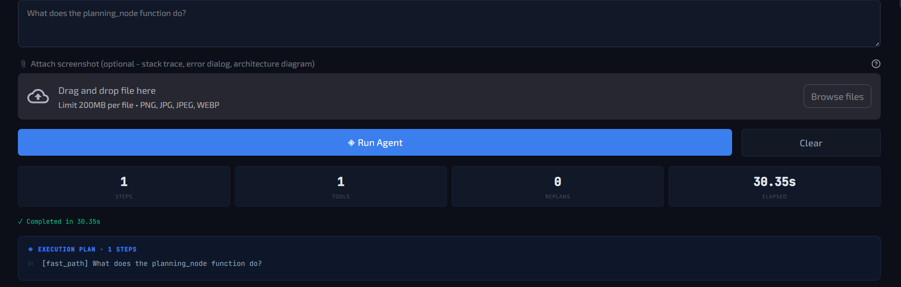
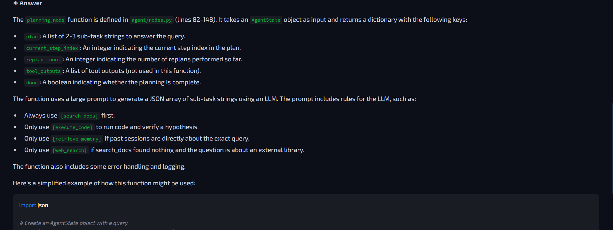

# Codebase Intelligence Agent

A local, offline agent for codebase question-answering. It ingests a repository, chunks it at the function/class level, and answers natural-language questions about the code using a locally hosted LLM. No cloud inference, no source code leaves the machine.

## Evaluation summary

50 test cases across 3 categories (`eval/test_cases.json`):

| Metric | Value |
|--------|-------|
| Task completion rate | 0.940 (47/50), 2 errors, 1 timeout |
| LLM-judged faithfulness | 0.88 |
| Keyword faithfulness | 0.79 |
| Tool precision | 0.68 |
| Tool recall | 0.78 |
| Avg. latency | 33.6s average|

Full per-case output is in `eval/results.json`. Results vary slightly between runs due to local model sampling and Ollama warmup state; the figures above are representative, not exact.

## Overview

The agent answers questions such as "where is `planning_node` defined" or "why does the `/checkout` endpoint return a 500 error on valid input" by:

1. **Memory retrieval** - querying past sessions in ChromaDB for related prior work
2. **Planning** - the LLM produces a short, tool-annotated plan
3. **Execution** - runs the plan (semantic code search, sandboxed code execution, or web search as needed)
4. **Replanning** - up to 2 retries if a step fails
5. **Synthesis** - produces a grounded answer referencing actual files, functions, and line numbers
6. **Memory write** - the session is embedded and stored for future retrieval

| Property | Typical RAG pipeline | This agent |
|----------|----------------------|------------|
| Code granularity | Fixed-size text chunks | Function/class level (tree-sitter) |
| Cross-session memory | None | Persisted in ChromaDB |
| Inference | Hosted API | Local (Ollama) |
| IDE integration | None | MCP server |
| Data locality | Leaves the machine | Stays local |

## Example

Query against this repo's own codebase, via the Streamlit UI:



The fast-path router recognized this as a simple lookup, skipped full planning, and answered in ~30s:



The answer correctly cites `agent/nodes.py` (lines 82-148) and accurately describes the function's return keys and internal logic.

Evaluation results:


The complete evaluation results and Full per-case output is in `eval/results.json`.

## Architecture

```
User Query
    |
    v
+-----------------------------------------------------------+
|                    LangGraph Agent                         |
|                                                             |
|  memory_retrieval -> planning -> execution -> [replan?]     |
|                                    |                        |
|                              tool_outputs                   |
|                                    |                        |
|                                    v                        |
|                              synthesis -> save_memory        |
+-----------------------------------------------------------+
         |                                    |
         v                                    v
   FastAPI Server                       ChromaDB
   /query (blocking)                  - project_docs (code chunks)
   /query/stream (SSE)                - session_memory (past sessions)
   /health                            - stackoverflow (Q&A pairs)
   /sessions
         |
         v
   MCP Server -> Cursor / VS Code / Claude Desktop
         |
         v
   Streamlit UI (localhost:8501)
```

### Node graph

```
start
  |
  v
memory_retrieval_node   ChromaDB search over past sessions
  |
  v
planning_node           Ollama (llama3.1:8b) generates a JSON plan
  |
  v
execution_node <----------+
  |                       |
  |-- success -------------+  (next step)
  |
  +-- failure --> replan_node (max 2 retries)
                        |
                        +-- exhausted --> synthesis_node
  |
  v (plan complete)
synthesis_node          converts tool outputs into a final answer
  |
  v
save_memory_node        embeds and persists the session
  |
  v
end
```

An entry router (`agent/router.py`) precedes the graph. Simple lookups ("what does X do", "where is Y defined") bypass planning and go through a single search-and-synthesize fast path, since running the full plan/execute/replan loop for single-step lookups added unnecessary latency.

### Tools

| Tool | Purpose | Implementation |
|------|---------|-----------------|
| `search_docs` | Semantic search over the ingested codebase | Direct ChromaDB query, BAAI/bge-small-en-v1.5 embeddings |
| `web_search` | External documentation and Stack Overflow lookup | DuckDuckGo search with retry on rate limiting |
| `execute_code` | Executes a Python snippet to verify a hypothesis | `subprocess.run`, 10s timeout, restricted import list |
| `retrieve_memory` | Retrieves related past debugging sessions | ChromaDB `session_memory` collection |


### Code-aware chunking

Source files are chunked at the function/class boundary using [tree-sitter](https://tree-sitter.github.io/tree-sitter/), with a regex-based fallback for languages without a parser configured. Each chunk includes metadata:

```json
{
  "file": "agent/nodes.py",
  "function": "planning_node",
  "start_line": 63,
  "end_line": 108,
  "type": "function",
  "language": "python",
  "docstring": "Generate a minimal, tool-annotated plan..."
}
```

Supported languages: Python, C, C++, CUDA (`.cu`, `.cuh`), Markdown, reStructuredText.

## Prerequisites

| Requirement | Version | Reference |
|-------------|---------|-----------|
| Python | 3.11 or later | python.org |
| Ollama | latest | ollama.com |
| Git | any | - |
| Docker | 24+, optional | only required for containerized deployment |

## Installation

### 1. Clone the repository

```bash
git clone https://github.com/hamzachoudhry9/codebase-intelligence-agent.git
cd codebase-intelligence-agent
```

### 2. Install Ollama and pull the model

macOS:
```bash
brew install ollama
ollama serve &
ollama pull llama3.1:8b
```

Linux:
```bash
curl -fsSL https://ollama.com/install.sh | sh
systemctl start ollama
ollama pull llama3.1:8b
```

Windows: install from ollama.com/download/windows, then run in PowerShell:
```
ollama pull llama3.1:8b
```

Verify:
```bash
curl http://localhost:11434/api/tags
```

### 3. Create a virtual environment

```bash
python -m venv venv
source venv/bin/activate        # Windows: .\venv\Scripts\Activate.ps1
pip install -r requirements.txt
```

### 4. Configure environment variables

```bash
cp .env.example .env
```

`.env.example`:
```env
OLLAMA_BASE_URL=http://localhost:11434
CHROMA_PERSIST_DIR=./chroma_db
DOCS_DIR=./docs
REPO_ROOT=.
AGENT_API_KEY=dev-key-change-in-production
PORT=8000
AGENT_API_URL=http://localhost:8000
```

Defaults are sufficient for local development.

### 5. Build the knowledge base

```bash
python ingest/build_index.py --repo . --docs docs/

# include Stack Overflow Q&A (cached after first run)
python ingest/build_index.py --repo . --docs docs/ --scrape-so

# index a different repository
python ingest/build_index.py --repo /path/to/target/repo
```

Expected output:
```
Loading embedding model (BAAI/bge-small-en-v1.5)... ready in 3.2s
Found 37 files in .
Total chunks: 228
  python: 120 chunks
  markdown: 108 chunks
'project_docs' -> 228 chunks

Sample chunks:
  [python  ] agent/nodes.py:planning_node - def planning_node(state: AgentState) ...
  [python  ] agent/tools.py:search_docs - @tool def search_docs(query: str) ...
```

## Running the system

### Local development (3 terminals)

Terminal 1, API server:
```bash
source venv/bin/activate
uvicorn api.main:app --host 0.0.0.0 --port 8000 --reload
```
Wait for:
```
[info] preload_graph_complete
[info] ollama_warmup_complete
[info] all_components_ready
INFO: Application startup complete.
```

Terminal 2, UI:
```bash
source venv/bin/activate
streamlit run ui/app.py
```
Accessible at `http://localhost:8501`.

Terminal 3, MCP server (optional):
```bash
source venv/bin/activate
python mcp_server/server.py
```

### Docker

```bash
docker-compose up --build
docker-compose exec agent python ingest/build_index.py --repo . --docs docs/
```

- API: `http://localhost:8000`
- UI: `http://localhost:8501`
- Ollama: `http://localhost:11434`

## API reference

### POST /query

Blocking request, returns the complete result.

```bash
curl -X POST http://localhost:8000/query \
  -H "Content-Type: application/json" \
  -H "X-API-Key: dev-key-change-in-production" \
  -d '{"query": "What does the planning_node function do?"}'
```

```json
{
  "answer": "The planning_node function is defined in agent/nodes.py (lines 63 to 108)...",
  "plan": ["[search_docs] What does the planning_node function do?", "[retrieve_memory] Check past sessions..."],
  "tools_used": ["search_docs", "retrieve_memory"],
  "replan_count": 0,
  "latency_s": 21.7
}
```

### POST /query/stream

Server-sent events, streams intermediate progress.

```bash
curl -X POST http://localhost:8000/query/stream \
  -H "Content-Type: application/json" \
  -H "X-API-Key: dev-key-change-in-production" \
  -d '{"query": "Debug a CUDA out-of-memory error"}' \
  --no-buffer
```

Event types:
```
data: {"type": "plan",        "data": ["[search_docs] ...", "[execute_code] ..."]}
data: {"type": "tool_call",   "data": {"tool": "search_docs", "task": "..."}}
data: {"type": "tool_result", "data": {"tool": "search_docs", "result": "...", "success": true}}
data: {"type": "replan",      "data": {"count": 1}}
data: {"type": "answer",      "data": "full answer text..."}
data: {"type": "done",        "data": {"latency_s": 21.7}}
```

### GET /health

```bash
curl http://localhost:8000/health
```

```json
{
  "status": "ok",
  "version": "2.1.0",
  "ollama_warmed_up": true,
  "index": {
    "project_docs_chunks": 228,
    "session_memory_sessions": 12
  }
}
```

Returns HTTP 503 with `"status": "degraded"` if the index is empty, indicating the ingest step has not been run.

### GET /sessions

Paginated session history via `?limit=` and `?offset=`.

```bash
curl "http://localhost:8000/sessions?limit=20&offset=0" \
  -H "X-API-Key: dev-key-change-in-production"
```

### POST /ingest

Triggers a background knowledge base rebuild and returns a job identifier for polling.

```bash
curl -X POST http://localhost:8000/ingest \
  -H "X-API-Key: dev-key-change-in-production" \
  -H "Content-Type: application/json" \
  -d '{"repo_path": ".", "wipe": true}'
```

## IDE integration (MCP)

The MCP server exposes the agent's tools to any MCP-compatible IDE.

### Cursor

Add `.cursor/mcp.json` in the project root:

```json
{
  "mcpServers": {
    "codebase-intelligence": {
      "command": "python",
      "args": ["/absolute/path/to/project/mcp_server/server.py"]
    }
  }
}
```

Restart Cursor; the tools will appear in the tool panel.

### VS Code (Continue extension)

Add to `~/.continue/config.json`:

```json
{
  "mcpServers": [
    {
      "name": "codebase-intelligence",
      "command": "python",
      "args": ["/absolute/path/to/project/mcp_server/server.py"]
    }
  ]
}
```

### Available MCP tools

| Tool | Description |
|------|-------------|
| `mcp_search_docs` | Semantic search over the codebase |
| `mcp_web_search` | DuckDuckGo web search |
| `mcp_execute_code` | Sandboxed Python execution |
| `mcp_retrieve_memory` | Past session retrieval |
| `mcp_full_query` | Executes the full agent pipeline via the API |

## Running evaluations

```bash
# API server must be running
python eval/evaluator.py --cases eval/test_cases.json --out eval/results.json

# keyword-only mode (faster, less precise)
python eval/evaluator.py --no-llm-judge
```

Sample output:
```
=== Evaluation Summary ===
task_completion_rate : 0.940   (47/50)
avg_llm_faithfulness : 0.812
avg_kw_faithfulness  : 0.734
avg_tool_precision   : 0.581
avg_tool_recall      : 0.742
avg_latency_s        : 24.6
n_errors             : 2
n_timeouts           : 1
n_low_faithfulness   : 4

By category:
  documentation_lookup             n=23  faithfulness=0.84  precision=0.69
  code_generation_and_verification n=18  faithfulness=0.77  precision=0.26
  debugging                        n=6   faithfulness=0.87  precision=0.83
```

Tool precision is lowest on the code-generation category: the planner frequently invokes `search_docs` even when the answer does not require it. This is a known limitation rather than a scoring artifact. The complexity router improves latency on simple lookups but does not fully address this on multi-step generation tasks.

## Indexing a different codebase

```bash
python ingest/build_index.py \
  --repo /path/to/target/repo \
  --docs /path/to/target/docs

mkdir -p data/error_logs
# place .txt files containing tracebacks and known fixes in data/error_logs/
python ingest/build_index.py --repo . --no-wipe   # append instead of rebuilding
```

## Additional component: execution-based benchmark

`bench/` contains a SWE-bench-style execution harness and a second agent (`agent/actor.py`) that edits files and reruns tests, distinct from the question-answering pipeline described above but sharing the same LLM infrastructure. Two of the harness commands run without Ollama:

```bash
python -m bench.selfcheck
python -m bench.smoke
```

See `docs/UPGRADE_GUIDE.md` for details.

## Project structure

```
.
├── agent/
│   ├── graph.py          # LangGraph StateGraph for the Q&A pipeline
│   ├── nodes.py          # memory, planning, execution, replan, synthesis, save, fast path
│   ├── router.py         # simple vs. complex query classifier
│   ├── state.py          # AgentState TypedDict
│   ├── tools.py          # search_docs, web_search, execute_code, retrieve_memory
│   ├── actor.py          # secondary agent: localize / edit / test / retry loop
│   ├── actor_tools.py    # workspace-scoped file tools for the actor
│   ├── llm.py            # model factory and FakeLLM for testing
│   ├── sandbox.py        # code-safety checks for execute_code
│   └── vision.py         # screenshot-to-text (local VLM with OCR fallback)
├── api/
│   ├── main.py            # FastAPI server (blocking, streaming, health)
│   └── ingest_router.py   # background /ingest endpoint
├── ingest/
│   ├── build_index.py     # knowledge base builder (code, docs, Stack Overflow)
│   ├── code_chunker.py    # tree-sitter chunking (Python, C++, CUDA, Markdown)
│   └── embed.py           # shared embedding model singleton
├── memory/
│   └── session_store.py   # ChromaDB session memory
├── mcp_server/
│   └── server.py          # FastMCP server exposing tools to IDEs
├── ui/
│   └── app.py              # Streamlit interface with SSE streaming
├── bench/                  # execution-based benchmark (see UPGRADE_GUIDE.md)
├── eval/
│   ├── evaluator.py        # LLM-as-judge and keyword evaluation harness
│   └── test_cases.json     # 50 test cases across 3 categories
├── docs/                   # source documents ingested into the knowledge base
├── data/
│   └── error_logs/         # user-supplied error log files
├── chroma_settings.py       # ChromaDB client factory (telemetry disabled)
├── Dockerfile               # API server container
├── Dockerfile.ui            # Streamlit container
├── docker-compose.yml        # Ollama, agent, and UI services
├── requirements.txt          # Python dependencies
└── .env.example               # environment variable template
```

## Design notes

**Local inference via Ollama.** Source code must not leave the machine, which rules out hosted inference regardless of the accuracy tradeoff against a frontier model.

**Direct ChromaDB queries rather than LlamaIndex's vector store wrapper.** The index is populated with custom metadata via direct inserts. LlamaIndex's `ChromaVectorStore` expects data in its own internal schema and returned empty results against externally inserted embeddings, so the collection is queried directly instead.

**Tree-sitter chunking rather than fixed-size windows.** Token-count-based splitting frequently cuts across function boundaries, causing retrieval to return partial, unrelated code. Chunking at the function/class level keeps each retrieved unit semantically complete.

**LLM-as-judge in addition to keyword matching.** Keyword matching alone penalizes valid paraphrasing (for example, scoring "memory exhausted" as a miss against an expected "out of memory"). The LLM judge captures semantic equivalence that keyword matching does not, though it introduces its own variance.

## Known limitations

- Tool precision on multi-step code-generation tasks is weak; the planner over-calls `search_docs`.
- Answer quality is bounded by the 8B local model and lags a hosted frontier model on tasks requiring deeper reasoning.
- The Stack Overflow scraper is subject to the public Stack Exchange API rate limit without an API key.
- Authentication is a single static API key, adequate for local or single-user use, not intended for multi-tenant deployment.

## License

AGPL-3.0
